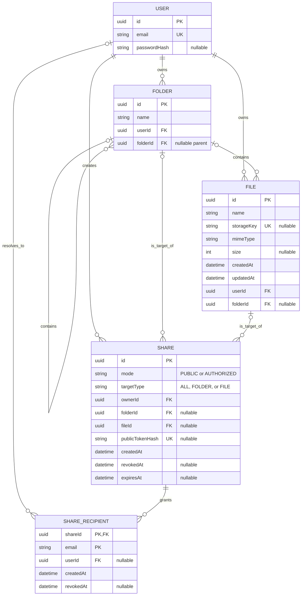

# Data Room Backend

Backend API for a data room application. It provides folder and PDF file management, private document storage, and public or authorized sharing.

## Technology stack

- **NestJS + TypeScript** — HTTP API and business logic.
- **PostgreSQL + Prisma ORM** — users, folders, files, and shared access.
- **JWT + Passport** — email/password and Google OAuth authentication.
- **Cloudflare R2** — private S3-compatible storage for PDF files.
- **Swagger** — interactive API documentation.

## Architecture

```text
HTTP request
    ↓
Controller → DTO validation → Service → Prisma → PostgreSQL
                               └──────→ Cloudflare R2
```

Main modules:

- `src/auth/` — registration, login, Google OAuth, JWT sessions, guards, and users.
- `src/data-room/` — folders, PDF files, search, uploads, and sharing.
- `src/prisma/` — shared Prisma client and PostgreSQL connection.
- `src/config/` — server, JWT, Google OAuth, and R2 configuration.
- `prisma/schema.prisma` — database models and relationships.

Controllers handle the HTTP layer, DTOs validate incoming data, and services contain business logic and database queries. All private resources are scoped to the current user.

The client uploads PDFs directly to a private R2 bucket using short-lived presigned URLs. The API validates each file and stores only its metadata in PostgreSQL. PDF downloads also use short-lived URLs without exposing internal object keys.

## Data model



Folders use an adjacency-list hierarchy: each folder stores an optional `folderId` pointing to its parent. A share targets the entire data room, one folder subtree, or one file. Authorized shares use `ShareRecipient` as the access-grant record; recipients can be stored by email before they register and linked to a user later.

## How it scales

### Folder subtree totals

For an occasional request, PostgreSQL can calculate a folder's complete subtree in one round trip. A recursive CTE starts with the requested folder, follows `Folder.folderId`, joins all matching files, and returns `COUNT(file.id)` plus `COALESCE(SUM(file.size), 0)`. Every part of the query must include `userId` so one user's hierarchy can never include another user's data. If “item count” includes folders as well as files, the same CTE can also return the descendant-folder count.

If subtree totals become a frequently displayed value, store cached `subtreeFileCount` and `subtreeSizeBytes` values per folder. Update the affected ancestor chain when files are created, moved, resized, or deleted. This trades more complex writes for constant-time reads; asynchronous updates are also possible when brief eventual consistency is acceptable.

### A data room with 100,000 files

The current list and search methods return all matching rows, so they must become bounded before reaching this scale:

- Use cursor pagination instead of offset pagination, with a stable order such as `(createdAt, id)` or `(name, id)` and a fixed maximum page size.
- Fetch only the current folder's immediate children and request totals separately; never load the full hierarchy or all matching files into one response.
- Add composite B-tree indexes matching ownership, parent, and sort filters, for example `File(userId, folderId, createdAt, id)`, `File(userId, folderId, name, id)`, and equivalent folder indexes.
- Use PostgreSQL `pg_trgm` GIN indexes (or a dedicated search service at a larger scale) for case-insensitive `contains` searches; a normal B-tree index does not accelerate `%term%` matching.
- Select only fields needed by the list view and keep file bytes in R2. Presigned uploads and downloads already prevent large PDFs from consuming API memory or bandwidth.

Cursor pagination keeps query cost and response size stable as the data room grows, while compound indexes avoid scanning every file owned by the user.

### Per-user viewer/editor roles

The existing sharing model already has the correct extension point: `ShareRecipient` is the join entity between a share and a recipient. Add a `role` field backed by an enum such as `VIEWER | EDITOR`, defaulting to `VIEWER`. Access checks then load the matching recipient grant and authorize the requested action from its role. Pending email recipients retain their assigned role when they later resolve to a `userId`.

This does not require changing the ownership, target, or hierarchy models. Public-token shares can remain read-only, while authorized recipients receive per-user roles on the same share.

## Local setup

### Requirements

- Node.js 20+
- npm
- Docker with Docker Compose

### 1. Install dependencies

```bash
npm install
```

### 2. Create the local configuration

```bash
cp .env.example .env
```

Generate a JWT secret and save it as `JWT_SECRET`:

```bash
openssl rand -base64 48
```

To use file storage, configure `R2_ACCOUNT_ID`, `R2_ACCESS_KEY_ID`, `R2_SECRET_ACCESS_KEY`, and `R2_BUCKET`. Google OAuth also requires `GOOGLE_CLIENT_ID`, `GOOGLE_CLIENT_SECRET`, `GOOGLE_CALLBACK_URL`, and `GOOGLE_SUCCESS_REDIRECT_URL`.

### 3. Start PostgreSQL and prepare the schema

```bash
npm run db:up
npm run db:push
npm run db:generate
```

`db:push` is intended for local development. Use `npm run db:migrate:deploy` in production.

### 4. Start the API

```bash
npm run start:dev
```

The API is available at `http://localhost:3000` by default:

- Swagger UI: `http://localhost:3000/api/docs`
- OpenAPI JSON: `http://localhost:3000/api/docs-json`

## Vercel deployment

Vercel detects `Dockerfile.vercel` and deploys the API as a container-backed
Node.js Function on Fluid compute. The image explicitly generates the ignored
Prisma Client before compiling the NestJS application. The `postinstall` script
also keeps non-container clean installs deployment-ready. `vercel.json` places
the Function in Frankfurt (`fra1`) next to the recommended database region.

### 1. Provision production services

- Create a managed PostgreSQL database. Prefer a serverless provider with a
  free tier and connection pooling, such as Prisma Postgres or Neon.
- Keep Cloudflare R2 private and configure its CORS policy to allow the
  production frontend origin to send `PUT` requests with the `Content-Type`
  header.
- Use stable custom domains where possible, for example `app.example.com` for
  the frontend and `api.example.com` for this API. Production auth cookies use
  `SameSite=None; Secure`, which also supports separate Vercel project domains.
  Custom domains are still preferred because browsers and privacy extensions
  may block third-party cookies between unrelated sites.
- Configure the frontend HTTP client to include credentials in API requests
  (`credentials: 'include'` for `fetch` or `withCredentials: true` for Axios).

### 2. Configure Vercel environment variables

Add these values to both Production and, when needed, Preview environments:

```text
DATABASE_URL                  pooled PostgreSQL runtime URL
DIRECT_URL                    direct PostgreSQL migration URL
CORS_ALLOWED_ORIGINS          exact comma-separated frontend origins
JWT_SECRET                    output of: openssl rand -base64 48
R2_ACCOUNT_ID                 Cloudflare account ID
R2_ACCESS_KEY_ID              R2 S3 API access key
R2_SECRET_ACCESS_KEY          R2 S3 API secret
R2_BUCKET                     private bucket name
MAX_PDF_SIZE_BYTES            optional; defaults to 52428800
R2_UPLOAD_URL_TTL_SECONDS     optional; defaults to 900
R2_DOWNLOAD_URL_TTL_SECONDS   optional; defaults to 900
GOOGLE_CLIENT_ID              Google OAuth client ID
GOOGLE_CLIENT_SECRET          Google OAuth client secret
GOOGLE_CALLBACK_URL           https://api.example.com/auth/google/callback
GOOGLE_SUCCESS_REDIRECT_URL   frontend URL after successful authentication
```

Do not configure `PORT` or the local `POSTGRES_*` Docker variables in Vercel.
Use separate databases and buckets for Preview and Production instead of
allowing preview deployments to modify production data.

### 3. Apply migrations and deploy

After importing the Git repository into Vercel and adding the environment
variables, link the local directory and apply the tracked migrations:

```bash
npx vercel@latest login
npx vercel@latest link
npx vercel@latest env run -e production -- npm run db:migrate:deploy
npx vercel@latest deploy --prod
```

Do not run migrations from every Vercel build because concurrent preview and
production deployments can race. After deployment, verify `/api/docs` and
`/api/docs-json`, then update the Google OAuth authorized redirect URI to the
final API domain.

## Useful commands

```bash
npm run build          # create a production build
npm run start:prod     # start the compiled application
npm run db:logs        # follow local PostgreSQL logs
npm run db:down        # stop PostgreSQL without deleting its data
npm run lint           # run ESLint checks
npm run format:check   # check formatting
```

## Main API features

- registration and login with email/password or Google;
- hierarchical folders and data room search;
- secure PDF upload, validation, and download;
- moving and deleting folders and files;
- public access through a secret token;
- authorized access for specified email addresses;
- shared-access expiration and revocation.

## Use of AI

AI was used as a development assistant to inspect the repository structure, cross-check the Prisma schema and service behavior, and draft or refine project documentation, including this ERD and scaling analysis. Generated content was checked against the source code, and the resulting Markdown was validated with the project's formatting tools. No production data, credentials, or secrets were provided to the AI.
